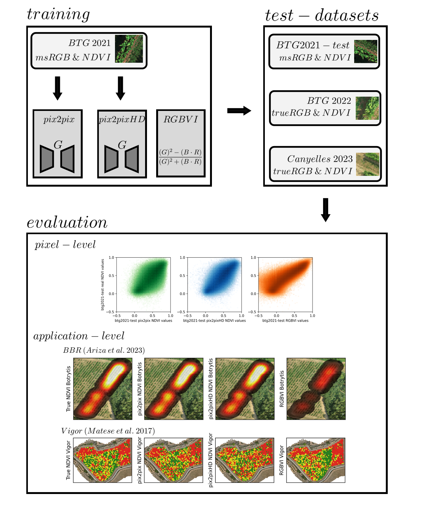

<div align="center">
  <p>
    <a href="https://icaerus.eu" target="_blank">
      </a>
    <h3 align="center">RGBtoNDVI Conversion using GANs ☀️ </h3>
    
   <p align="center">
    Evaluating Pix2Pix GANs for RGB to NDVI in vineyards using UAV data and practical evaluations.
    <br/>
    <br/>
    <br/>
    <br/>
    <a href="https://github.com/icaerus-eu/RGBtoNDVIconversion/issues">Report Bug</a>
    .
    <a href="https://github.com/icaerus-eu/RGBtoNDVIconversion/issues">Request Feature</a>
  </p>
</p>
</div>

      

## Table Of Contents

* [Summary](#summary)
* [Features](#features)
  * [1. Training set creation](#1-training-set-creation)
  * [2. Testing set creation](#2-testing-set-creation)
  * [3. Pix2Pix (HD) training](#3-pix2pixhd-training)
  * [4. Generating NDVI](#4-generating-ndvi)
  * [5. Reconstructing orthomosaic](#5-reconstructing-orthomosaic)
  * [6. Preprocessing evaluation datasets](#6-preprocessing-evaluation-datasets)
  * [7. Pixel-level evaluation](#7-pixel-level-evaluation)
  * [8. BBR evaluation](#8-bbr-evaluation)
  * [9. Vigor evaluation](#9-vigor-evaluation)
* [Installation](#installation)


## Summary
Evaluating GAN results could be viewed through an application-perspective, where the approach is evaluated beyond direct metrics of accuracy, but a usability-lens, asking the question: 'is the output of the GAN good enough for an NDVI application?'

Furthermore, the generalization of the Pix2Pix model is also explored, by evaluating on different datasets to the training dataset. A different location: Canyelles in 2023, and in a different year: Bodegas Terras Gauda 2022, as well as different RGB sensors. The model is trained on a multispectral composite of Red, Green and Blue bands, whilst Canyelles 2023 and Bodegas Terras Gauda 2022 have true RGB sensors.

This repository supports the work in: [Evaluating Generalization of Methods for Artificially Generating NDVI from UAV RGB Imagery in Vineyards](https://www.mdpi.com/2072-4292/17/3/512). Presenting all the steps in the evaluation approach of the generated NDVI maps through Jupyter Notebook implementations.



## Features

There are 9 distinct steps to the study: creating datasets, training the GAN (Pix2Pix), generating new NDVI maps from RGB, reconstructing this back into the orthomosaic, preprocessing the datasets for further evaluation,  and then the three evaluations: pixel, botrytis bunch rot and vigor mapping. These can all be found under the `notebooks` folder. All the data ([from Zenodo](https://zenodo.org/records/15051398)), should be placed in the  `data` folder.

Required data inputs:
- _btg2021_ multispectral orthomosaic
- _btg2022_ multispectral orthomosaic
- _btg2022_ RGB orthomosaic
- _btg2022_ Digital Surface Model
- _can2023_ multispectral orthomosaic
- _can2023_ RGB orthomosaic
- _can2023_ Digital Surface Model


### 1. Training set creation
As we are dealing with 2 models: Pix2Pix and Pix2PixHD, requires the training dataset to be made twice, from the same orthomosaic, once at 256x256 resolution, and once at 512x512 resolution.

This is performed in the notebook: [`1_training_set_creation.ipynb`](notebooks/1_training_set_creation.ipynb)
It also structures these datasets accordingly in training/evaluation/testing splits.

### 2. Testing set creation
Additionally, the Pix2Pix models require chips of the correct size, this means that the testing sets (_btg2022_ and _can2023_) also need to be processed to that end.

This is performed in the notebooks: [`2_testing_set_creation.ipynb`](notebooks/2_testing_set_creation.ipynb) It also structures these chips accordingly for Pix2Pix to read the files correctly.

### 3. Pix2Pix(HD) training
For Pix2Pix: taken almost directly from the pytorch [CycleGAN and Pix2Pix](https://github.com/junyanz/pytorch-CycleGAN-and-pix2pix) repository. For training the models.
For Pix2PixHD, it is adjusted to the [NVIDIA Pix2PixHD](https://github.com/NVIDIA/pix2pixHD) repository. Which essentially runs the same training code and data structure.

This is also covered in the training notebook: [`3_p2p_training.ipynb`](notebooks/3_p2p_training.ipynb). Which requires a slightly different environment: this is covered in the notebook.

### 4. Generating NDVI
Generating the NDVI is performed on the test datasets, using the model weights from the training process. Found under the respecitve Pix2Pix and Pix2PixHD `model_weights` folder.
This is also covered in notebook: [`3_p2p_training.ipynb`](notebooks/3_generating_ndvi.ipynb).

* Download the model-weights: [Pix2Pix](https://e.pcloud.link/publink/show?code=kZyTwWZGhaoeY4npaV2Nqv4xSPQl5Ljww57), [Pix2PixHD](https://e.pcloud.link/publink/show?code=kZvGjnZABud1a0x8bXFy0XMV9KbppJTbivX)

### 5. Reconstructing orthomosaic
The generated NDVI chips should be reconstructed and aligned back into its original shape in the orthomosaic. This is covered in notebook: [`5_reconstructing_ortho.ipynb`](notebooks/5_reconstructing_ortho.ipynb). 

### 6. Preprocessing evaluation datasets
The various evaluations require some additional datasets, consisting of alignment, setting NULL values, writing them into a single folder in `data/preprocessed/`. This is covered in notebook: [`6_preprocessing_eval.ipynb`](notebooks/6_preprocessing_eval.ipynb).

### 7. Pixel-level evaluation 
The first evaluation is at the pixel-level. Flattening the orthomosaics and checkig for absolute accuracy, as well as noise and structural similarity between true and generated NDVI. This is covered in notebook: [`7_pixel_level_eval.ipynb`](notebooks/7_pixel_level_eval.ipynb) 

### 8. BBR evaluation
Using the implementation of botrytis-bunch-rot mapping algorithm from [Ariza et al. (2023)](https://github.com/mararizasentis/bbr). The NDVI maps are compared in mapping out botrytis risk in the vineyard. This is covered in notebook: [`8_bbr_eval.ipynb`](notebooks/8a_bbr_eval.ipynb).

### 9. Vigor evaluation
The final step is evaluating the generated NDVI maps in a vigor-mapping application from [Matese et al. 2018](https://www.mdpi.com/2077-0472/8/7/116). This is covered in notebook: [`9_vigor_eval.ipynb`](notebooks/9_vigor_eval.ipynb).

## Installation:

The approach makes heavy use of `uavgeo`. This is built upon the work of `rioxarray`,  `geopandas`, `shapely` and a few more.
You can choose to install everything in a Python virtual environment or directly run a jupyterlab docker:
Some notebooks require a slightly different, incompatible environment: such as running the Pix2Pix models, as well as the BBR-heatmap creation, this is covered in those respective notebooks.

##### Option A: Setup directly in python:
1. Create a new environment (optional but recommended):
   
   ```bash
   conda create -n uavgeo_env python=3.10
   conda activate uavgeo_env
   ```
2. Install `uavgeo` package (for now: pip only)
   ```bash
       pip install uavgeo
   ```

##### Option B: Setup through Docker:
This starts a premade jupyter environment with everything preinstalled, based around a nvidia docker image for DL support.
* Linux/Ubuntu:
  ```bash
  docker run --rm -it --runtime=nvidia -p 8888:8888 --gpus 1 --shm-size=5gb --network=host -v /path_to_local/dir:/home/jovyan jurrain/drone-ml:gpu-torch11.8-uavgeoformers
  ```

`--network=host` flag whether you want to run it on a different machine in the same network, and want to access the notebook. (does not run locally)

`-v` flag makes sure that once downloaded, it stays in that folder, accessible from the PC, and when restarting, all the weights etc. remain in that folder. `path_to_local/dir` is thew path to your working dir where you want to access the notebook from. can be `.` if you already `cd`ed into it.

` --runtime=nvidia` can be skipped when working on WSL2


* Windows requires WSL2 and NVIDIA drivers, WSL2 should also have the nvidia toolkit (for deep learning)
